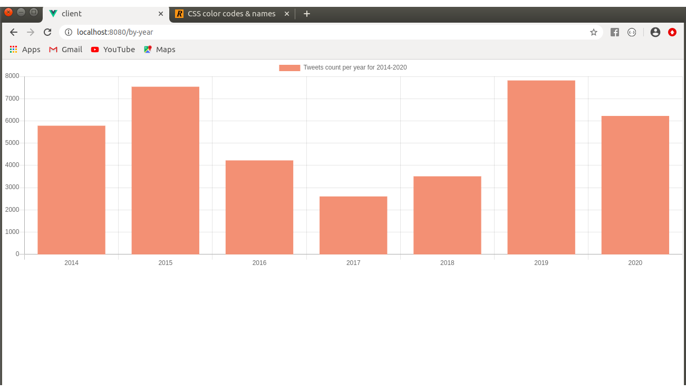
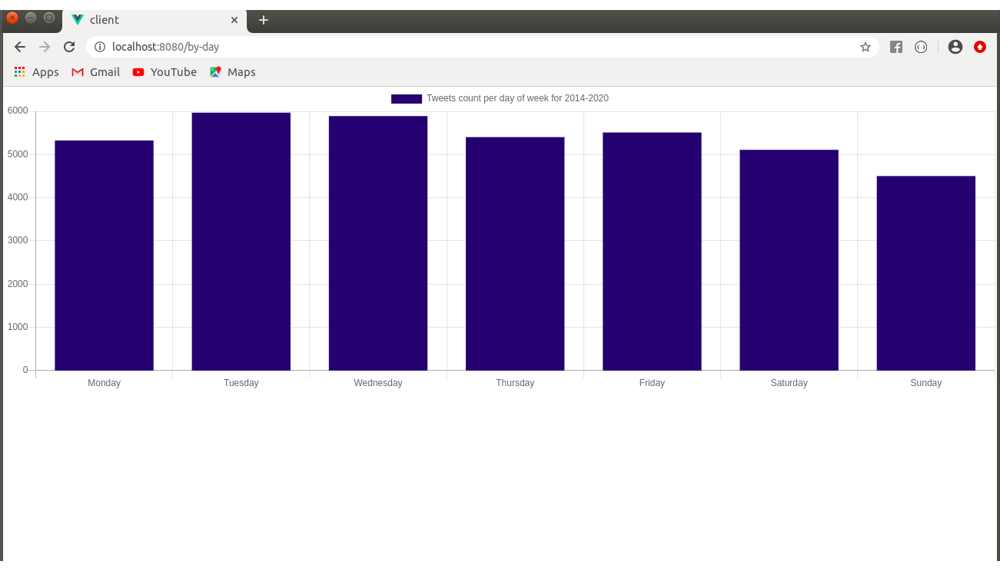
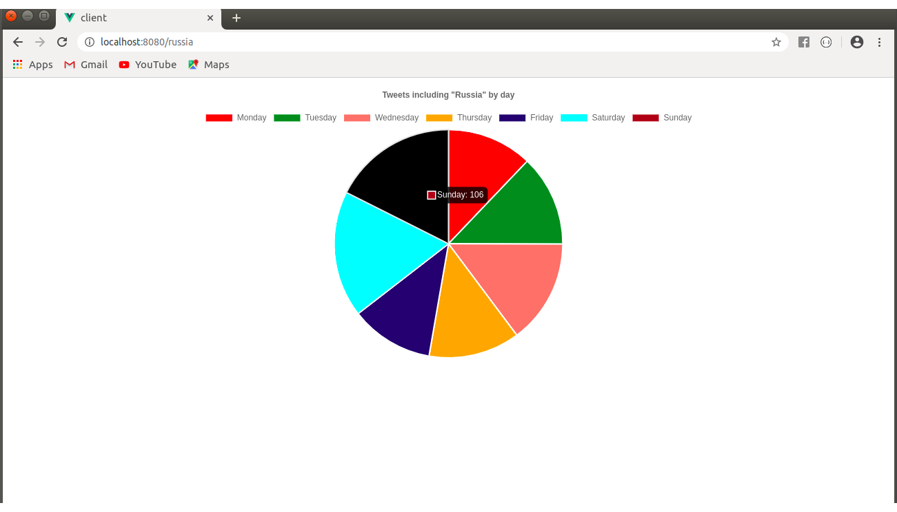

# graph-donald-trump
A single-page project that downloads Donald Trump tweets for 2014-2020 period from [here](http://trumptwitterarchive.com/) and represents a few statistics using flask and Vue.js.

  

# Installation:

1. Install MongoDB: https://docs.mongodb.com/manual/tutorial/install-mongodb-on-ubuntu/
2. Install pymongo: `$ pip install pymongo`
3. Install flask: `$ pip install Flask==1.0.2 Flask-Cors==3.0.7`
4. Install Vue.js: `$ npm install -g @vue/cli@3.7.0`
5. Install axios: `$ npm install axios@0.18.0 --save`

# Start:

`$ mkdir graph-donald-trump-tweets`

`$ cd graph-donald-trump-tweets`

`$ sudo service mongod start`

**Open a new terminal**

`$ mkdir graph-donald-trump-tweets`

`$ cd graph-donald-trump-tweets`

`$ sudo service mongod start`

`$ cd flask-crud-vue/server`

`$ python app.py`

**Open a new terminal**

`$ cd graph-donald-trump-tweets/flask-crud-vue/client`

`$ npm run serve`

**The statistics are visible on:**

https://localhost:8080/by-year

https://localhost:8080/by-day

https://localhost:8080/by-russia

NOTE: check the port of the client (might not be 8080)!
